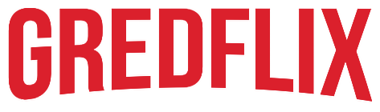

<h1 align="center">
    
</h1>

## :desktop_computer: Projeto

Baseado no frontend do site da Netflix, o Gredflix serve como host dos seus vídeos favoritos da plataforma YouTube. 

## :gear: Tecnologias
- [ReactJS](https://reactjs.org)
- Futuras implementações...

## :balance_scale: Licença

Esse projeto está sob a licença MIT.
